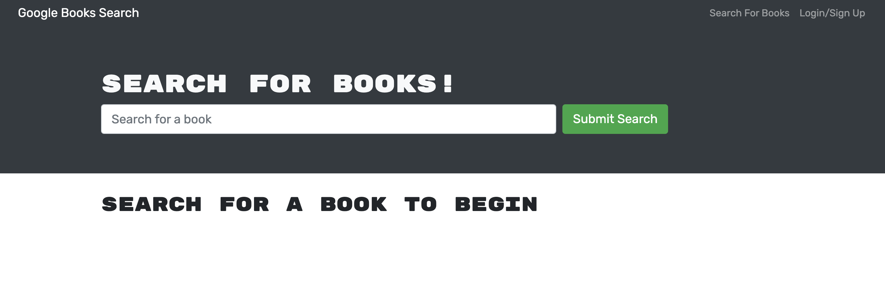
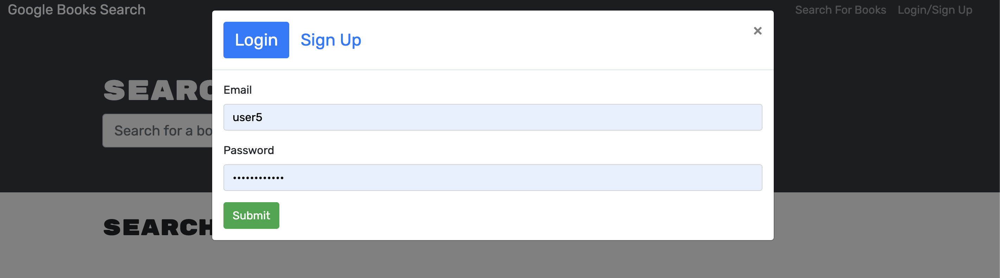
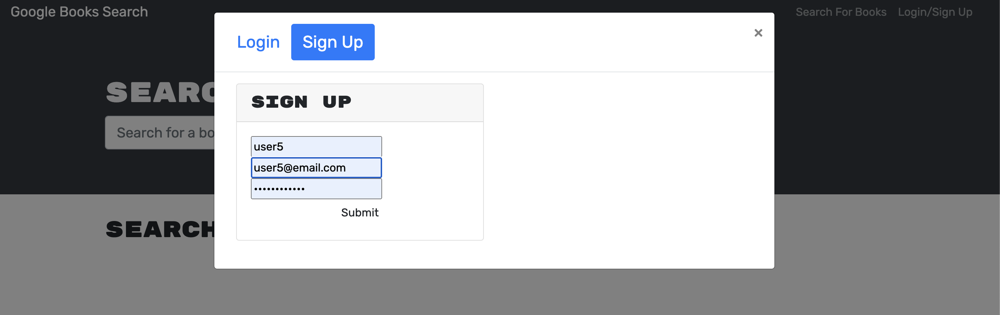
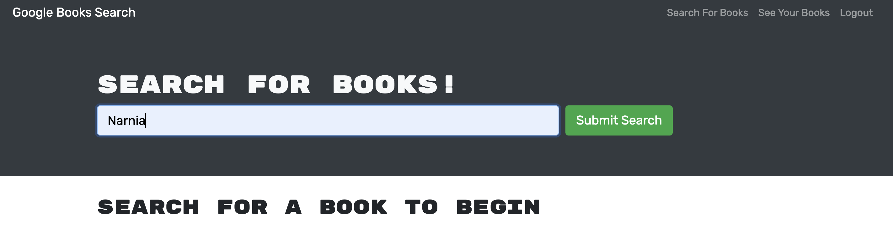
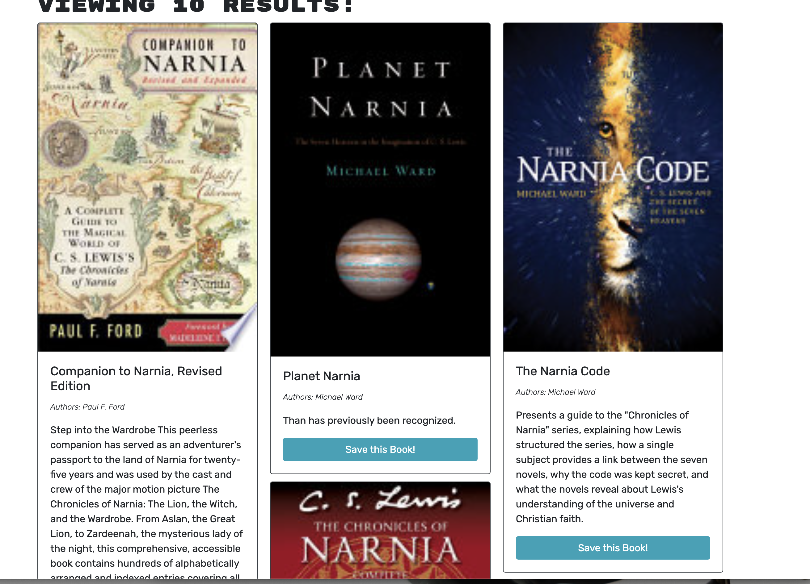
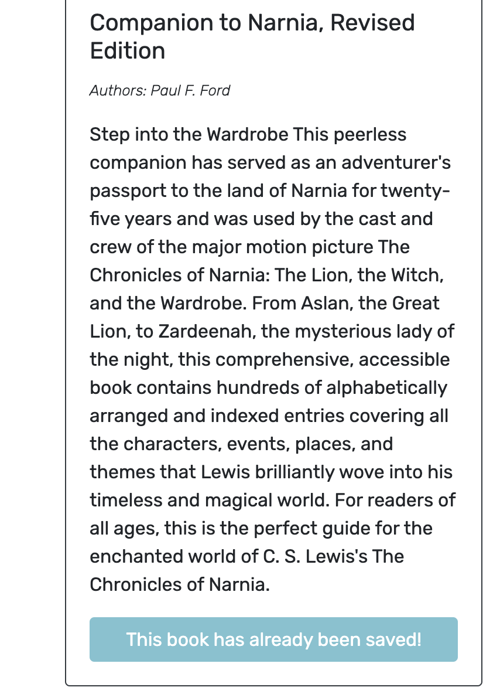
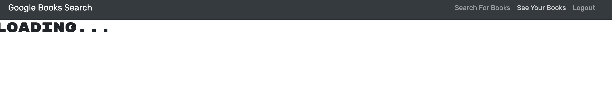

# redesigned-guide

## Description 
This application is a MERN Book Search Application using the Google Books Search API. 

## Table of Contents 
[Usage](#usage)  
[Road Map](#road-map)  
[License](#license)  
[Status](#status)  

## Usage 
In order to use this application, the user can click the deployed application link. 
Once the application is open, the user will see the first page where they can sign-in or sign-up.

Once the user has either signed-in or signed-up, the page will indicate the user to logout where the signin/signup was. 

The user can then search for books and save them, view the books they have already saved, and delete books they no longer want saved.

## Road Map 
Future Iterations of this project will include working save books links, a working book list page, and the ability to delete the books on the books list page. 

## License 
[MIT](https://choosealicense.com/licenses/mit/)

## Status
